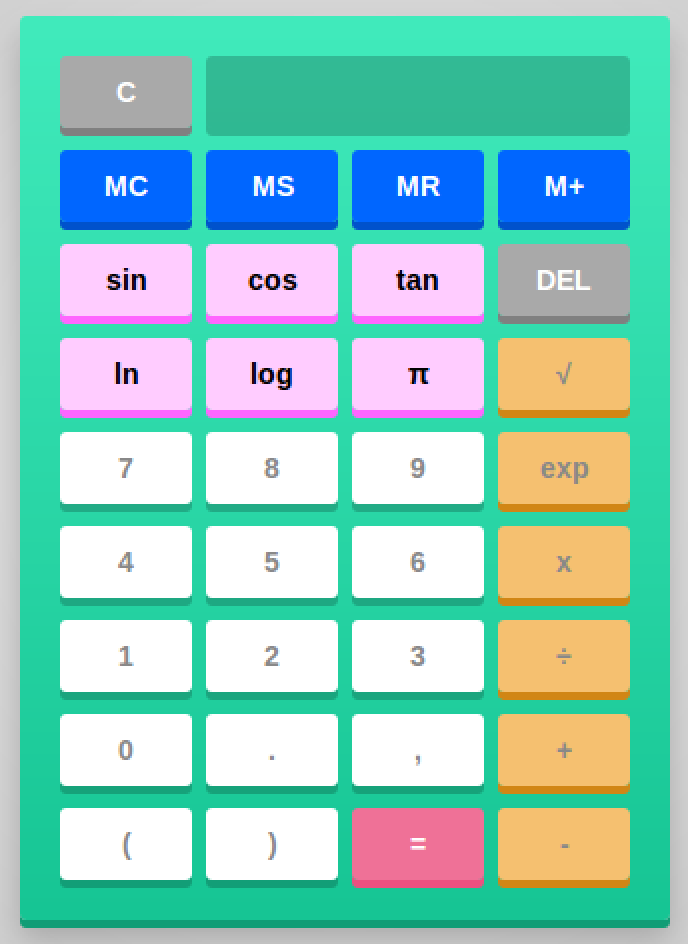

# JavaScript Calculator #

<br><br>


***This program uses Middleman and JavaScript to display a functional calculator***

##Requirements##
- Ruby v2.2.2
- Ubuntu 14.04 LTS
- Mozilla Firefox
- The 'middleman' gem
```
//To install required gem, do:
$ gem install middleman
```
```
//The installation process will add one new command to your environment/directory, with features you can use:
$ middleman init
$ middleman server
$ middleman build
```

> **NOTE:**
> - This has only been tested with the above requirements. Other operating systems and other versions of Ruby may also work.

##Starting the Program##
To run the program, do:
```
$ cd <path/to/JavaScriptCalculator/>
$ ruby run.rb
```
After running **run.rb**, the program will begin

> - Changes can be viewed live while editing /DavisSiteUpgrade/source/*.html.erb

##Use##

###Entering Expressions###
This calculator allows you to enter expressions as a whole string such as:
```
1 + 6 x 4 - 3
```
As a user, you can expect the calculator to complete the calculation using the standard order of operations, PEMDAS.

###Powers###
To calculate the result of a number to the power of another number, you must use the ```exp``` button. First press the button then ```pow(``` will appear on the screen, then enter the base followed by a comma, then enter the exponent followed by a closed parenthese. The exponent can be a part of any expression and will still be properly evaluated.
```
x^y  =>  pow(x,y)
```
###Root###
To calculate a root of a number, you must use the ```√``` button. First press the button then ```sqrt(``` will appear on the screen, then enter the number whose root you want to take followed by a comma, then enter the root followed by a closed parenthese. The sqrt() function can be a part of any expression and will still be properly evaluated.
```
x√y  =>  sqrt(y,x)
```

###π###
To use π (pi), simply press the button with the pi symbol on it. 
```
Valid:    2*pi
Invalid:  2pi
```

###Trig Functions###
All three trig functions - Sine, Cosine, and Tangent - are calculated in radians.

###Memory Functions###
- MS will save current result to memory
- MC will reset the number in memory to 0
- M+ will add the current result to the number in memory
- MR will display the number in memory to screen

##Limitations##
Due to JavaScript only allowing floating point arithmetic, operations such as ```1.2 - 1.1``` will have results such as ```0.09999999999999987``` instead of ```0.1``` which is a known limitation of javascript.

##Debugging##
If firefox opens but the page does not load, check the terminal and look for something like the following:
```
== The Middleman uses a different port "<some number>" then the configured one "4567" because some other server is listening on that port.
== View your site at "http://VirtualBox.local:<some number>", "http://10.0.2.15:<some number>"
```
Follow the instructions and type ```http://VirtualBox.local:<some number>``` into your browser to view the page.

##Sources##
CSS3 3D Button - [http://www.paulund.co.uk][1]

[1]: http://www.paulund.co.uk/create-a-css-3d-push-button
